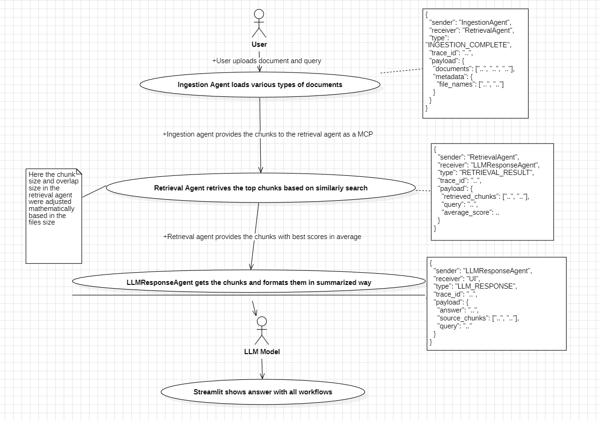

# 📚 Agentic RAG Chatbot – Multi-Format Document QA

## 🔗 Overview
This project implements an **Agentic Retrieval-Augmented Generation (RAG) chatbot** that answers user questions based on documents uploaded in **PDF, PPTX, DOCX, CSV, TXT/Markdown** formats. The architecture uses multiple agents that communicate via a structured **Model Context Protocol (MCP)**.

## ✅ Features
- Multi-format ingestion
- Agent-based pipeline (IngestionAgent, RetrievalAgent, LLMResponseAgent)
- MCP message passing
- Multi-turn conversation with chat history
- Vector store with HuggingFace embeddings & FAISS
- Streamlit UI

## 🗂️ Folder Structure

project\_root/
├── agents/
│   ├── ingestion.py
│   ├── retrienvalagent.py
│   ├── response.py
├── app.py
├── .env
├── README.md
└── tmp/

## ⚙️ Tech Stack
- Python
- LangChain
- HuggingFace Embeddings (all-MiniLM-L6-v2)
- FAISS
- Groq LLM (deepseek-r1-distill-llama-70b)
- Streamlit
- dotenv

## 🧩 MCP Message Examples

{
"sender": "IngestionAgent",
"receiver": "RetrievalAgent",
"type": "INGESTION\_COMPLETE",
"trace\_id": "trace-001",
"payload": {
"documents": \["..."],
"metadata": { "file\_names": \["..."] }
}
}
{
"sender": "RetrievalAgent",
"receiver": "LLMResponseAgent",
"type": "RETRIEVAL\_RESULT",
"trace\_id": "trace-001",
"payload": {
"retrieved\_chunks": \["..."],
"query": "...",
"average\_score": "..."
}
}
{
"sender": "LLMResponseAgent",
"receiver": "UI",
"type": "LLM\_RESPONSE",
"trace\_id": "trace-001",
"payload": {
"answer": "...",
"source\_chunks": \["..."],
"query": "..."
}
}

`

## ▶️ How to Run
1. Clone the repo
2. Install dependencies
   
   `pip install -r requirements.txt`

3. Add keys to `.env`

   env
   HF_TOKEN=...
   GROQ_API_KEY=...
4. Run
   `streamlit run app.py`

## 📸 Workflow 

## ⚡ Challenges

* Chat history directly in prompt was inefficient — used RunnableWithMessageHistory instead.
* Optimal chunk sizing.

## 🚀 Future Scope

* Use LangGraph for full agent orchestration.
* Add persistent vector store.

**Author:** Rohith Kumar
**Email:** [rohitofficial9989@gmail.com](mailto:rohitofficial9989@gmail.com)
**Phone:** 7702295908

